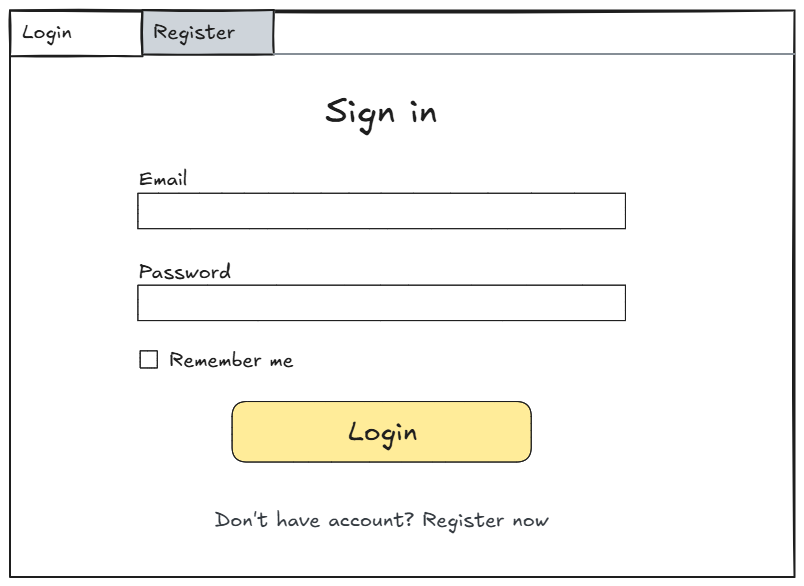
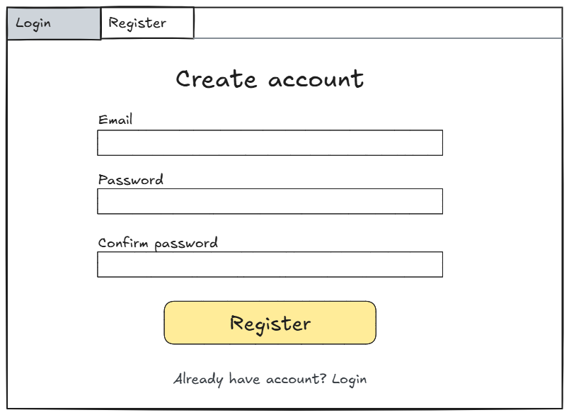
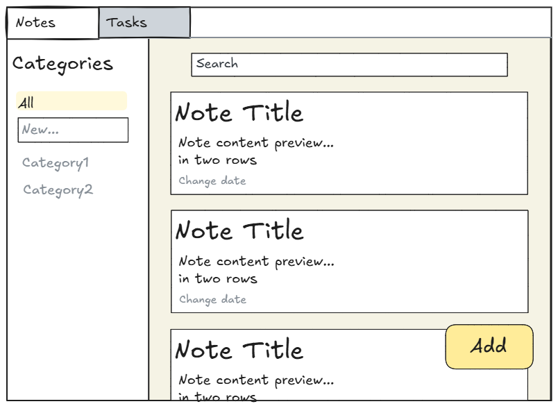
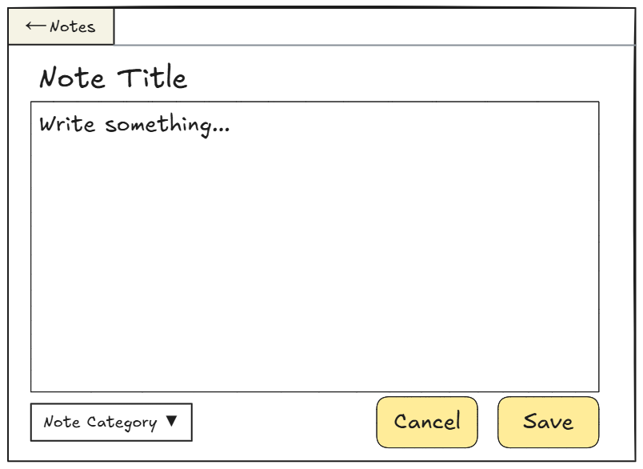
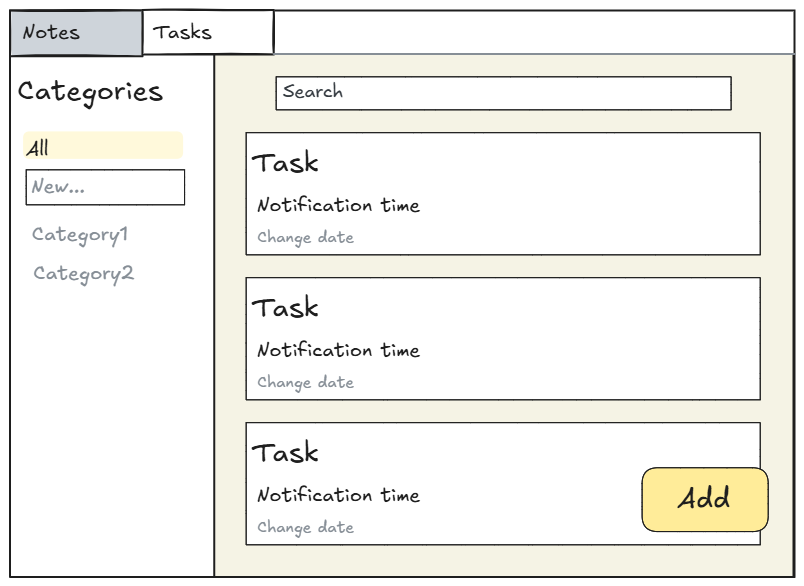
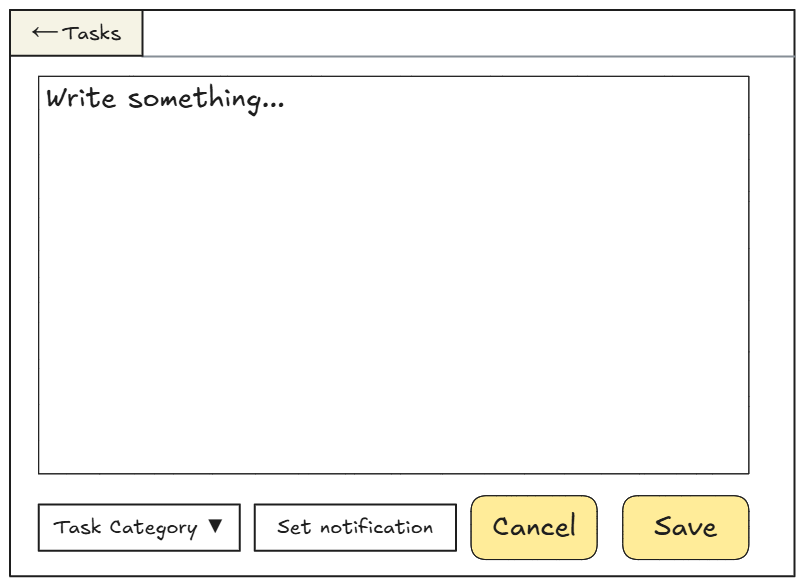
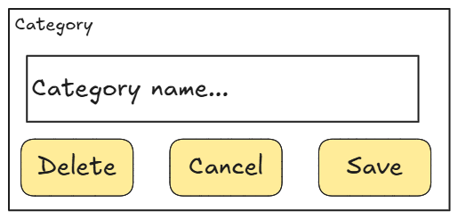

# 🖥️ WpfNotes — Desktop Client for DoNote

**WpfNotes** is a desktop application built with **WPF and MVVM**, designed to work seamlessly with the **DoNote API** (`WebNotes`).  
It allows users to manage **notes and tasks** with a clean, intuitive interface.

---

## 🚀 Features (in development)

- ✅ User login & registration via JWT
- ✅ Auto-login on startup (token persistence)
- ✅ Create, view, edit, and delete notes
- ✅ Manage tasks with optional reminders
- ✅ Category-based organization
- ✅ Responsive UI with clean navigation
- ✅ Full MVVM pattern implementation

---

## 🛠 Technologies

- **UI Framework**: WPF (.NET 9.0)
- **Architecture**: MVVM (Model-View-ViewModel)
- **Dependency**: Requires `WebNotes` API backend

---

## 🎨 UI Mockup

