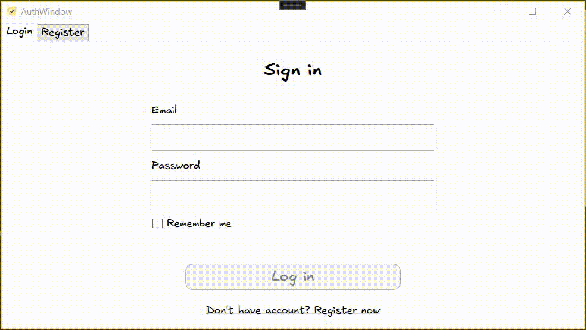
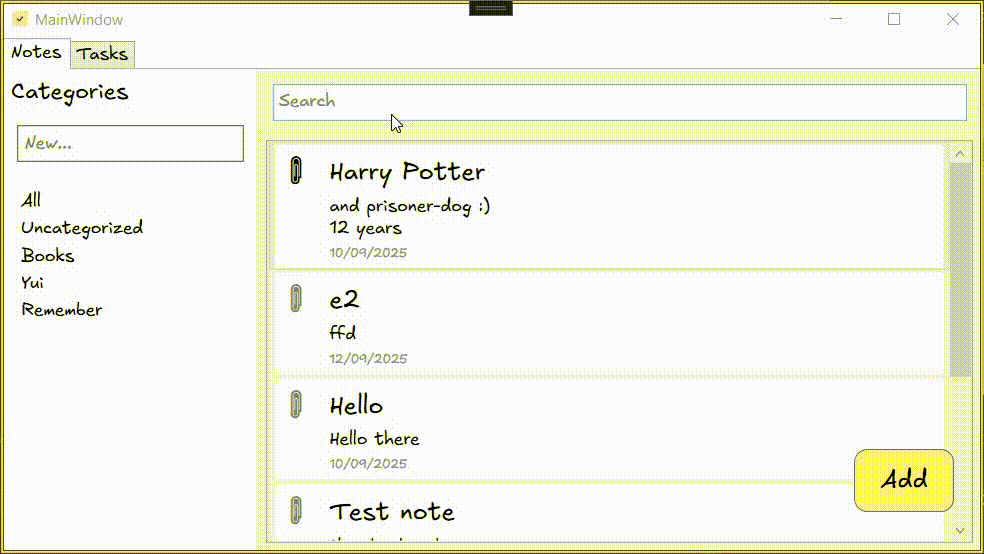

# 🖥️ WpfNotes — Desktop Client for DoNote

**WpfNotes** is a desktop application built with **WPF and MVVM**, designed to work seamlessly with the **DoNote API** (`WebNotes`).  
It allows users to manage **notes and tasks** with a clean, intuitive interface.

---

## 🚀 Features

- ✅ **JWT Authentication**: Login & registration with secure token handling  
- ✅ **Auto-login on startup**: Token stored in user settings  
- ✅ **Full CRUD** for Notes, Tasks, and Categories  
- ✅ **Task Reminders**: Time-based notifications  
- ✅ **Responsive UI**: Clean navigation, dark/light theme support  
- ✅ **MVVM Architecture**: Full separation of concerns  
- ✅ **Custom Font**: Uses [Excalifont](https://plus.excalidraw.com/excalifont) — a beautifully hand-drawn, open-source font designed for optimal legibility and charm.  
  Originally developed for Excalidraw in 2024 as the successor to Virgil, Excalifont preserves the warmth of handwritten text while enhancing clarity — making it perfect for note-taking apps.  
  Licensed under **OFL-1.1**, it’s free for personal and commercial use.

---

## 🛠 Technologies

- **UI Framework**: WPF (.NET 9.0)
- **Architecture**: MVVM (Model-View-ViewModel)
- **Dependency**: Requires `WebNotes` API backend

---

## 📁 Project Structure

```
WpfNotes/
├── ApiModels/          # DTOs from WebNotes API
├── Commands/           # Custom ICommand implementations
├── Fonts/              # Excalifont
├── Models/             # Business models (Note, Task, Category)
├── Resources/          # Icon
├── Services/           # Core logic (Api, Auth, Window, Confirm, Reminder)
├── ViewModels/         # MVVM ViewModels (LoginViewModel, etc.)
├── Views/              # XAML views (AuthView.xaml, etc.)
├── App.xaml            # Entry point + global styles
├── Settings.settings   # User preferences and token storage
├── appsettings.json    # External API configuration
└── WpfNotes.csproj
```

---

## ⚙️ Configuration

The application reads its API endpoint from `appsettings.json`:

```json
{
  "ApiSettings": {
    "BaseUrl": "https://donote.onrender.com/",
  }
}
```
By default, it uses [DoNote](https://donote.onrender.com/).

---

## 🎨 UI Mockup

| Login | Register |
|-------|----------|
|  |  |

| Notes List | Note Detail |
|------------|-------------|
|  |  |

| Tasks List | Task Detail |
|------------|-------------|
|  |  |

| Categories |
|------------|
|  |

---

## 🎥 Live Demos (GIF Animations)

Watch how WpfNotes works in action:





> All animations are optimized for fast loading and clear visibility. 

---

### 🔐 Token Persistence

The application stores the JWT token securely using `Settings.settings`:

- After successful login, the token is saved to `Settings.Default.JwtToken`.
- On startup, the app checks for a stored token and attempts auto-login.
- If the token is expired or invalid, the user is redirected to login.

> ⚠️ This method is **not encrypted** by default. For production, consider using `SecureString` or Windows Credential Manager.
